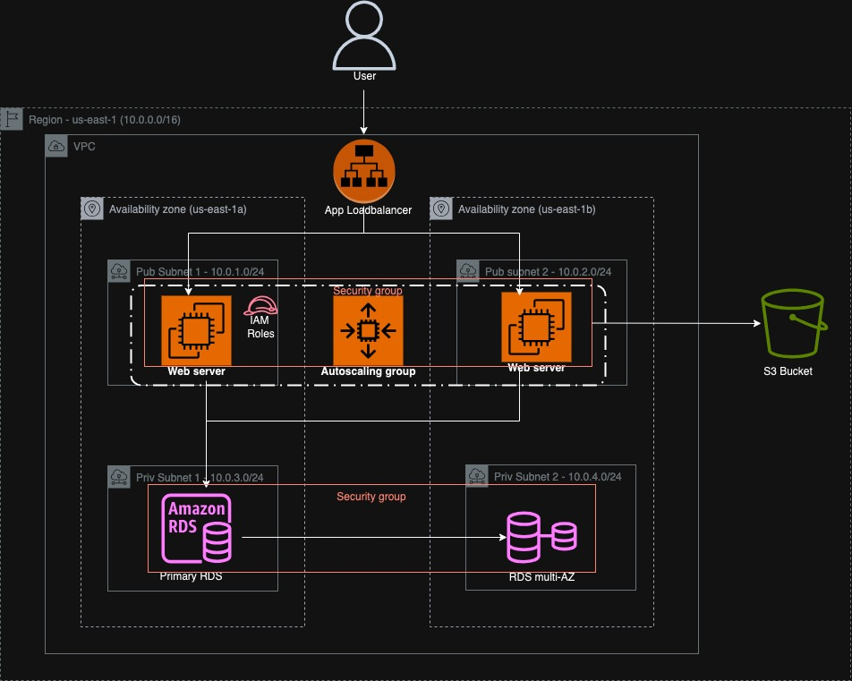
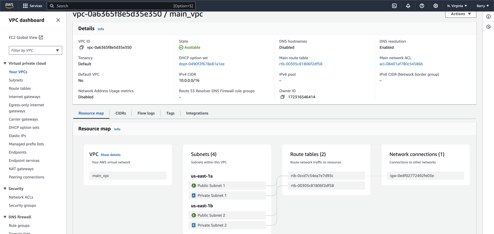
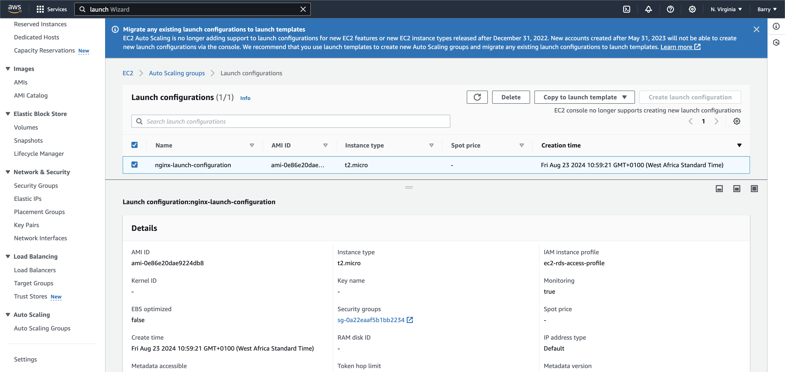
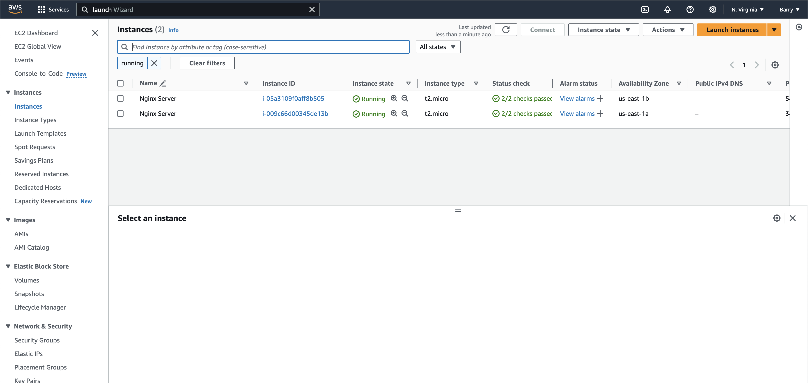
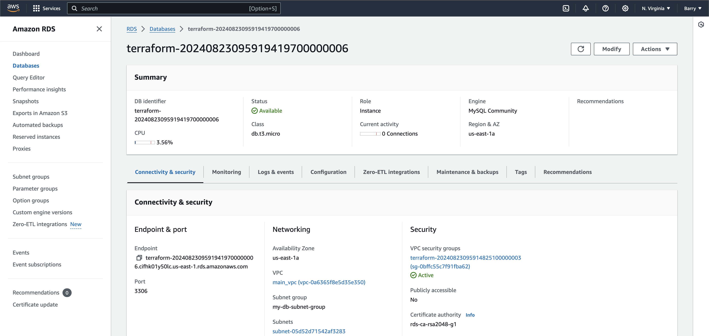
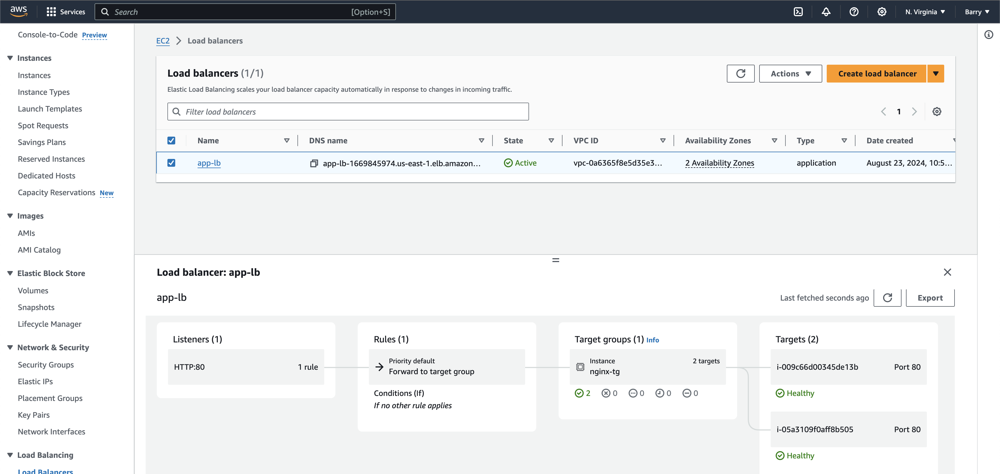
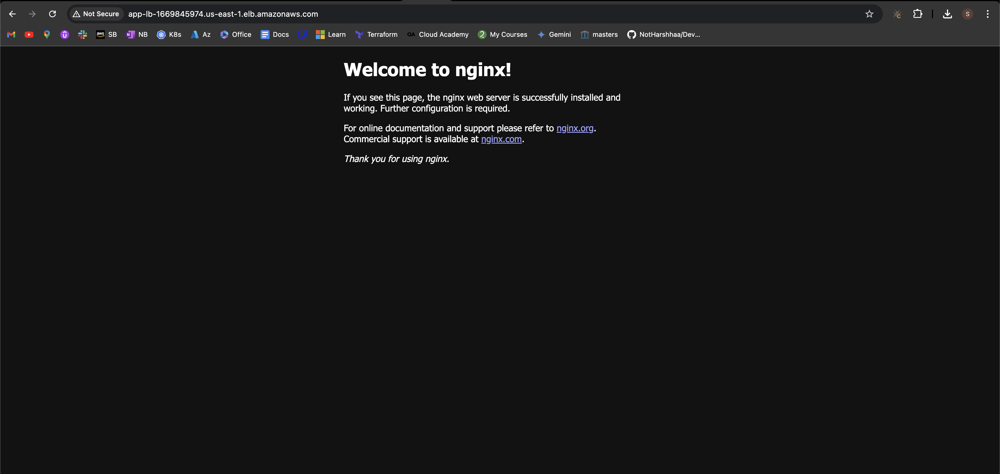
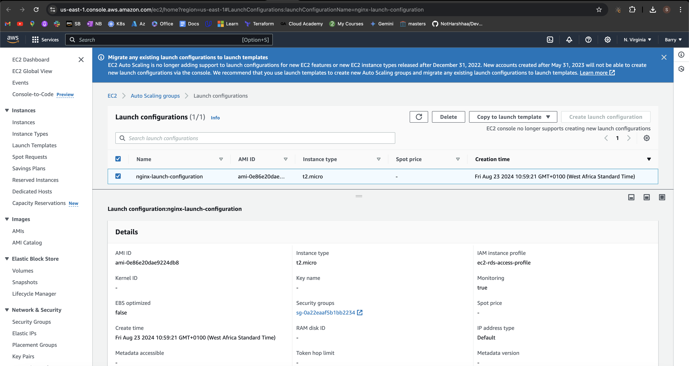
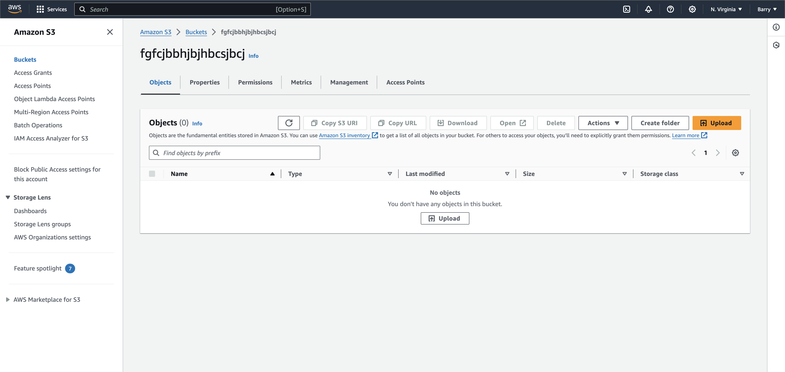

# AWS Infrastructure Setup with Terraform

This repository contains Terraform scripts to set up a scalable and highly available infrastructure on AWS. The infrastructure includes a VPC, subnets, an EC2 instance running Nginx, an RDS MySQL instance, and Application Load Balancer (ALB).

## Table of Contents

- [Architecture Overview](#architecture-overview)
- [Infrastructure Components](#infrastructure-components)
  - [VPC and Subnets](#vpc-and-subnets)
  - [EC2 Instance with Nginx](#ec2-instance-with-nginx)
  - [RDS MySQL Database](#rds-mysql-database)
  - [Application Load Balancer (ALB)](#application-load-balancer-alb)
  - [Auto Scaling Group (ASG)](#auto-scaling-group-(asg))
  - [S3 Bucket for EC2 access](#s3-bucket-for-ec2-access)
- [Setup and Usage](#setup-and-usage)
- [Backup and Recovery](#backup-and-recovery)
- [Security](#security)
- [Improvements and Future Work](#improvements-and-future-work)

## Architecture Overview

The architecture is designed for scalability, high availability, and security. It consists of:

1. **VPC with Two Public and Two Private Subnets**: Ensures separation of publicly accessible resources and privately accessible resources.
2. **Nginx Running on EC2 Instances in Public Subnets**: Serves web traffic, routed through an Application Load Balancer (ALB) for high availability.
3. **RDS MySQL Database in Private Subnet**: Provides a secure and scalable database solution, configured for Multi-AZ for high availability.
4. **S3 Bucket**: Stores Terraform state files to ensure state management and facilitate collaboration.


## Infrastructure Components

### VPC and Subnets

- **VPC**: A custom VPC is created to host all resources. It provides network isolation and control over IP address ranges.
- **Subnets**: Two public subnets and two private subnets are created to host different components:
  - Public subnets: Host EC2 instances running Nginx and the ALB.
  - Private subnets: Host the RDS instance.


### EC2 Instance with Nginx

- **Purpose**: The EC2 instance hosts Nginx, which serves as the web server. This is done through launch configuraton.
- **Security**: The Nginx server is not directly accessible from the internet. Traffic is routed through the ALB.
- **IAM Role**: The EC2 instance is assigned an IAM role that allows access to the RDS instance and the S3 bucket.





### RDS MySQL Database

- **Configuration**: The RDS instance is configured with the following parameters:
  - Engine: MySQL 8.0
  - Instance Type: `db.t3.micro`
  - Multi-AZ: Enabled for high availability
  - Automated Backups: Enabled with a 7-day retention period
- **Security**: The RDS instance is placed in a private subnet and can only be accessed from EC2 instances within the VPC and also made the user apply their username and password from the cmd, although this is not the best practice, other tools to use in encrypting secret include secret manager, azure vault and others.


### Application Load Balancer (ALB)

- **Purpose**: The ALB distributes incoming HTTP requests across the Nginx EC2 instances in the public subnets, ensuring high availability.
- **Target Group**: A target group is configured to register the EC2 instances dynamically.


- Access application at load balancer url

### Auto Scaling Group (ASG)

- **Purpose**: The ASG ensures that the number of EC2 instances adjusts automatically based on demand. It maintains high availability and consistent performance.
- **Configuration**: The ASG is configured with a minimum and maximum number of instances, scaling policies, and CloudWatch alarms to trigger scaling events.


### s3 bucket for ec2 access

- **Purpose**: The S3 bucket is used to objects.
- **Access**: The bucket policy restricts access so that only the EC2 instances with a specific IAM role can access it.


## Setup and Usage

1. **Clone the Repository**:
   ```bash
   git clone https://github.com/yourusername/aws-infrastructure-terraform.git
   cd aws-infrastructure-terraform


2.  Initialize Terraform:

        terraform init


3.  Review the Terraform Plan:

        terraform plan

4.  Apply the Terraform Configuration:

        terraform apply


5.  Verify the Setup:
    - Check the AWS Management Console to verify the creation of VPC, subnets, EC2 instances, RDS instance, ALB, ASG and S3 bucket.

##  Backup and Recovery
-   Automated Backups: The RDS instance is configured to take automated backups daily, with a retention period of 7 days.
-   Manual Snapshots: You can create manual snapshots of the RDS instance as needed using the AWS Management Console or Terraform.

##  Security
-   Security Groups: Security groups are configured to control access to the EC2 instances and RDS instance. Only specific IP ranges and instances within the VPC are allowed access.
-   IAM Roles: IAM roles are assigned to EC2 instances to grant necessary permissions for accessing RDS and S3.
-   Private Subnets: The RDS instance is placed in a private subnet to prevent direct access from the internet.

##  Improvements and Future Work
-   Monitoring: Set up monitoring and alerting using AWS CloudWatch to track the health and performance of the infrastructure.
-   CI/CD Pipeline: Integrate a CI/CD pipeline to automate deployment and management tasks.
-   S3 State file and versioning to improve collaboration and maintain terraform state.